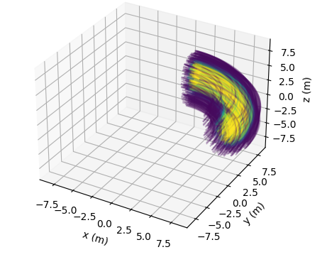
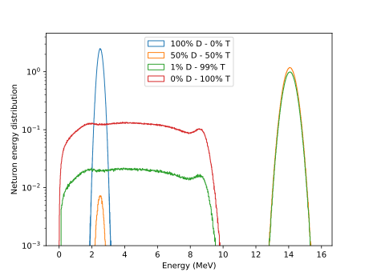

# Summary

`openmc-plasma-source` is a Python-based package offering a collection of pre-built neutron sources designed for fusion applications using the Monte Carlo particle transport code OpenMC [@romano_openmc_2015].
By providing ready-to-use implementations for various neutron source configurations, such as tokamak, ring, and point sources, this package simplifies the often complex task of neutron source definition in fusion-related Monte Carlo simulations.
These sources are parameterised to account for spatial distributions, plasma temperatures, plasma pressure, and fusion fuel compositions.
DT (deuterium, tritium) plasmas with any ratio of D and T are supported including pure DD and pure TT plasmas.
The package computes spatial distributions of temperature and density and accounts for them when computing the spatially distributed reactivity for the differentfusion reactions availablein the fuel composition.
The temperature, density and fuel composition are accounted for when producing the neutron energy distribution which also varies spatially. 
energy distributions  of neutron sources.
The approach take is also computationally efficient by making use of rotational symmetry to reduce the size of the source definition.

The package is designed to integrate seamlessly into OpenMC workflows, allowing users to define sources in just a few lines of Python code.
It also supports advanced features like temperature-based neutron spectra and spatial source distributions, making it an invaluable tool for researchers simulating neutron behaviour in fusion devices.

# Statement of need

Accurate modelling of neutron sources is critical for fusion energy research, underpinning tasks such as reactor shielding design, material testing, and tritium breeding analysis.
In this context, OpenMC is a widely used tool for neutron transport simulations [@romano_openmc_2015].
However, creating realistic neutron source models for fusion applications can be a time-consuming and error-prone process, requiring detailed knowledge of plasma physics and significant coding effort.

Traditionally, researchers have implemented their own custom neutron source definitions, which often results in redundant work and inconsistencies between studies.
For example, spatial distributions, temperature effects, and fuel compositions must be correctly parameterised to ensure the fidelity of the simulations.
The lack of standardised tools for these tasks introduces variability, potential errors in simulations and a lack of reproducibility.

`openmc-plasma-source` addresses these challenges by providing a standardised and easy-to-use interface for defining neutron sources in OpenMC. The package implements the equations for neutron distributions based on established models, such as those described in @fausser_tokamak_2012 and fusion energy spectra from the NeSST tool @Crilly_NESST_-_Neutron_2024. By automating the setup process and including extensive documentation and examples, it reduces barriers to entry for researchers new to OpenMC or neutron source modelling.

# Pre-Built Configurations

With pre-built configurations for tokamak, ring, and point sources, `openmc-plasma-source` is suitable for a wide range of applications. For example:

- The **tokamak source** models realistic spatial and temperature distributions, optimised for computational efficiency through the use of ring sources (see \autoref{fig:tokamak_source} and \autroef{3d_tokamak_source}).
- The **ring source** offers a simplified yet effective representation for cylindrical geometries.
- The **point source** is ideal for preliminary studies or cases requiring a concentrated neutron emission found in inertial confinement fusion or sealed-tube neutron generators.

{ width=50% }

{ width=50% }

# Custom Energy Spectra

`openmc-plasma-source` allows for customisation of neutron energy spectra based on varying fusion fuel compositions and spatial parameters. Users can define different fuel mixtures (e.g., DT, DD, TT) with associated spatially resolved temperature and density profiles, ensuring accurate and precise energy distributions. This flexibility is crucial for capturing the full range of neutron behaviours in complex fusion scenarios (see \autoref{fig:energy_spectra}).

The package’s open-source nature and community-driven development further ensure its adaptability and relevance to the evolving needs of the fusion research community.

# Example usage

Examples can be found in the examples folder of the repository.

# Acknowledgements

We acknowledge contributions from the OpenMC development team and the fusion energy community for their feedback and support.

# References
